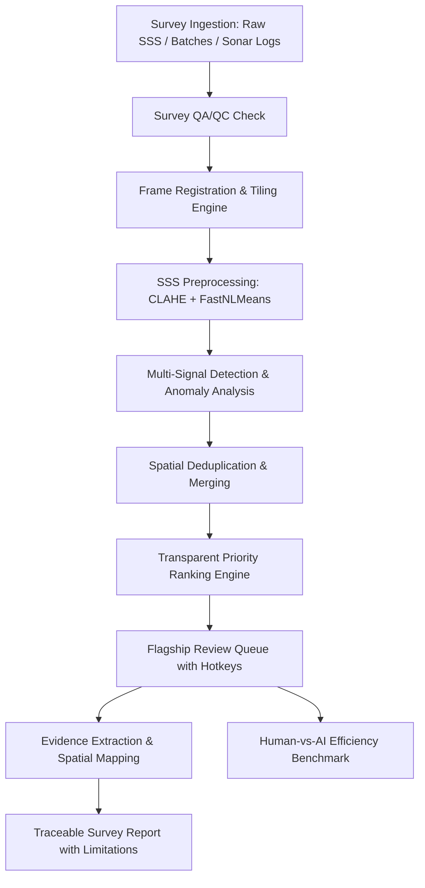

# AquaVision AI (SIH26057) — Comprehensive System Upgrade Audit

**Audit Date**: August 27, 2026  
**Problem Statement**: SIH26057 — Automated Underwater Marine Debris & Anomaly Detection System using Side-Scan Sonar (SSS)  
**Objective**: Transform from prototype into a technically credible, evidence-driven, survey-scale SSS intelligence and prioritized human-review system.

---

## 1. Feature-by-Feature Technical Audit Table

| Feature / Subsystem | Current State | Backend Connected? | Real Data? | Real AI? | Persisted? | Tested? | Synthetic? | Hard-coded? | Problem / Gap | Recommended Fix | Priority |
|---|---|---|---|---|---|---|---|---|---|---|---|
| **Mission Dashboard** | Functional KPI & chart interface | Yes (FastAPI `/analytics/overview`) | Partially (synthetic seeded survey) | Yes (Priority engine aggregation) | Yes (SQLite) | Yes (pytest + build) | Yes (seeded 50 frames) | No | Static feel if backend offline; lack of live screening rate | Add live survey progress monitor, Inspection Focus card, dynamic workload metrics | **P0** |
| **Survey Ingestion** | Single/Batch survey creation wizard | Yes (`/surveys`, `/upload-batch`) | Yes (PNG/JPG image frames) | N/A | Yes (`surveys`, `survey_files`, `survey_frames`) | Yes | Yes (demo frames) | No | Lacks format parser documentation for XTF/JSF/HSX/GCF; no survey QA/QC check | Build multi-format sonar parser with explicit `STATUS = NOT_IMPLEMENTED` extension points for raw binaries; add Survey QA/QC | **P0** |
| **Frame Tiling & Preprocessing** | Tile slicing with CLAHE + fastNlMeans | Yes (`TilingEngine`, `SSSPreprocessor`) | Yes (real CV2 matrix ops) | Algorithmic signal processing | Yes (`survey_tiles`) | Yes (`test_ml_pipeline.py`) | No (runs on any input image) | No | Preprocessing parameters not visible in viewer; missing transformation inspection | Add Preprocessing metadata drawer (CLAHE clip, tile size, stride, denoise $h$) in viewer | **P0** |
| **Analysis Workspace (Viewer)** | Interactive Canvas with zoom/filters | Yes (`/surveys/{id}/frames`, `/candidates`) | Yes (frame files in storage) | Yes (heuristic contour detector) | Yes | Yes | Yes (demo targets) | Partially | Canvas lacked multi-channel layer toggle (`RAW`, `ENHANCED`, `DETECTIONS`, `ANOMALY HEATMAP`, `EVIDENCE`); false-color sonar palettes missing | Build multi-channel layer switcher, false-color acoustic palettes (Copper, Amber, Bone, Jet), acoustic shadow/target inspection | **P0** |
| **Anomaly Detection** | Gaussian variance + Laplacian texture scoring | Yes (`SSSAnomalyDetector`) | Yes (CV2 gradient variance) | Unsupervised signal variance | Yes (`anomalies`) | Yes | No | Traceable demo threshold (0.50) | Anomaly threshold source was not explicitly labeled; anomaly cards lacked distinct evidence types | Add explicit threshold provenance (`DEMO CONFIGURATION` vs `VALIDATED`), generate distinct evidence crops | **P0** |
| **Candidate Priority Engine** | Transparent weighted 4-factor scoring | Yes (`PriorityEngine`) | Yes | Yes (Formula: $0.35A + 0.25C + 0.20T + 0.20U$) | Yes (`candidates`) | Yes | No | Configurable weights | Users couldn't click to see the exact breakdown of the 4 factors | Add "Why High Priority?" modal/drawer breaking down anomaly, confidence, type, and uncertainty contributions | **P0** |
| **Ghost Net Terminology** | Used "Abandoned Fishing Net" | Yes | No | No (unvalidated class) | Yes | Yes | Yes | Terminology | Presenting unvalidated detections as confirmed "Abandoned Fishing Net" violates honesty protocol | Replace with "Potential Net-like Anomaly" / "Potential Fishing Gear" with experimental badge | **P0** |
| **Human Review Queue** | Interactive decision cards | Yes (`/review/candidates/{id}/action`) | Yes | Human-in-the-loop | Yes (`corrections`, audit log) | Yes | No | No | Missing keyboard shortcuts (`A`, `R`, `U`, `N`, `P`) and efficiency timer | Add keyboard shortcuts, review efficiency benchmarking, direct evidence zoom | **P0** |
| **Geospatial Survey Map** | WGS84 Spatial canvas | Yes (`/maps/survey/{id}/candidates`) | Synthetic coordinates | Geometric projection | Yes (`locations`) | Yes | Yes | Coordinates | Lack of coordinate quality indicator (`HIGH`, `MEDIUM`, `LOW`, `UNAVAILABLE`) and map $\leftrightarrow$ review synchronization | Add coordinate quality badge, click-to-review sync, click-to-map sync | **P1** |
| **Survey QA/QC Center** | Missing | No | N/A | N/A | No | No | N/A | N/A | No dedicated survey data quality & integrity screening page | Add Survey QA/QC module (File Integrity, Navigation Quality, Coverage, Frame Completeness) | **P1** |
| **AI Model Center** | Model version listing | Yes (`/models`) | N/A | Metadata registry | Yes (`model_versions`) | Yes | No | No | Lacked confusion matrices, error analysis (false positives/negatives), and scientific limitations | Add deep model cards, failure mode taxonomy, and evaluation benchmark links | **P1** |
| **Dataset Registry** | Dataset provenance listing | Yes (`/datasets`) | Metadata | Provenance registry | Yes (`datasets`) | Yes | No | No | Lacked quality checklist (License Verified, Modality Checked, Leakage Checked) | Add 7-point dataset quality validation checklist | **P1** |
| **Human-vs-AI Benchmark** | Basic DB model | Partially | Simulated data | Comparative benchmark | Yes (`benchmark_runs`) | No | Yes | Hard-coded | No dedicated UI comparing manual vs AI-assisted review efficiency | Build Human-vs-AI Review Efficiency Benchmark page | **P2** |
| **Processing Logs** | Stored in JSON on DB | Yes (`/processing/jobs`) | Live execution | Pipeline logging | Yes (`processing_jobs`) | Yes | No | No | Technical processing logs were not prominently visible on survey detail page | Add live chronological log viewer with timestamped execution steps | **P1** |
| **PDF Report Generator** | PDF generation using ReportLab | Yes (`/reports/generate/{id}`) | Yes (live survey DB state) | Synthesized summary | Yes (`reports`, `storage/reports`) | Yes | No | No | Reports lacked explicit "AI Evidence & Scientific Limitations" section | Upgrade report generator with full methodology, model provenance, and limitations disclosure | **P1** |
| **System Health Center** | Health API routes | Yes (`/health`, `/health/db`, `/health/ml`, `/health/storage`) | Real status checks | System metrics | Live | Yes | No | No | UI lacked visual system health indicator for all 5 subsystems | Add Health status dashboard drawer / indicator in UI | **P2** |

---

## 2. Core Architectural Upgrades Plan

---

## 3. Execution Priority Order
1. **P0 (Realism & Core Workflow)**:
   - SSS Preprocessor & Multi-Channel Visualizer (`RAW`, `ENHANCED`, `DETECTION`, `ANOMALY`, `EVIDENCE`).
   - Sonar Log Format parser (`XTF`, `JSF`, `HSX`, `GCF`) with truthful implementation status.
   - Distinct Anomaly Evidence Generator with traceable thresholds.
   - Transparent Priority Engine drawer ("Why High Priority?").
   - Ghost-net terminology normalization to "Potential Net-like Anomaly".
   - Flagship Review Queue with keyboard shortcuts (`A`, `R`, `U`, `N`, `P`).
2. **P1 (Credibility & Field Operations)**:
   - Survey QA/QC Center.
   - Map $\leftrightarrow$ Review bidirectional synchronization with coordinate quality ratings.
   - Deep Model Registry with Error Analysis & Failure Taxonomy.
   - Dataset Provenance 7-point Quality Checklist.
   - Timestamped Survey Technical Processing Logs.
   - Enhanced PDF Report with AI Evidence & Limitations.
3. **P2 (Impact & Benchmarking)**:
   - Human-vs-AI Review Efficiency Benchmark.
   - System Health Center (`API`, `DB`, `AI`, `STORAGE`, `QUEUE`).
   - Survey-scale workload visualization.
4. **P3 (Verification & Final Report)**:
   - Automated pytest & static build verification.
   - Create `docs/UPGRADE_REPORT.md`.
